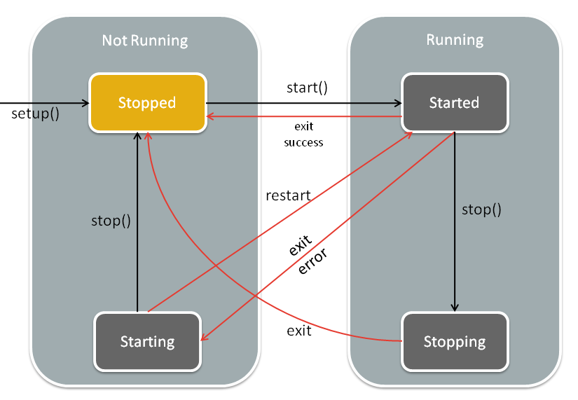
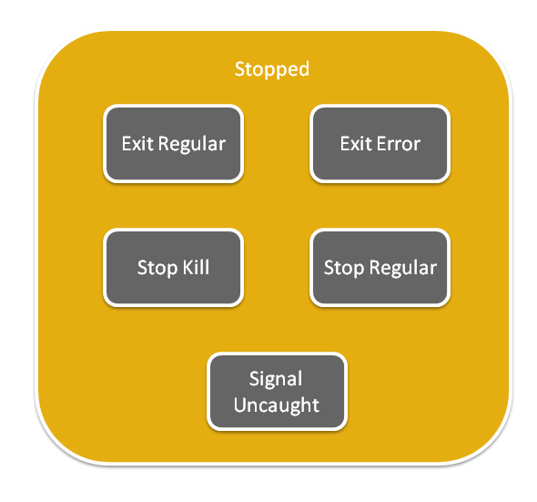

Platform : Appmon Daemon
========================

This page last changed on Mar 30, 2012 by lbarthelemy.

[1. Goals and context](#AppmonDaemon-Goalsandcontext)

[2. External Interface and
usage](#AppmonDaemon-ExternalInterfaceandusage)

[2.1. Start the daemon](#AppmonDaemon-Startthedaemon)

[2.2. Socket Interface](#AppmonDaemon-SocketInterface)

[2.3. Commands](#AppmonDaemon-Commands)

[2.3.1. Generic command format](#AppmonDaemon-Genericcommandformat)

[2.3.2. Generic command response
format](#AppmonDaemon-Genericcommandresponseformat)

[2.3.3. Setup command](#AppmonDaemon-Setupcommand)

-   [2.3.3.1. actions](#AppmonDaemon-actions)
-   [2.3.3.2. setup response format](#AppmonDaemon-setupresponseformat)

[2.3.4. Start command](#AppmonDaemon-Startcommand)

-   [2.3.4.1. actions](#AppmonDaemon-actions.1)
-   [2.3.4.2. start response format](#AppmonDaemon-startresponseformat)

[2.3.5. Stop command](#AppmonDaemon-Stopcommand)

-   [2.3.5.1. actions](#AppmonDaemon-actions.2)
-   [2.3.5.2. stop response format](#AppmonDaemon-stopresponseformat)

[2.3.6. Remove command](#AppmonDaemon-Removecommand)

-   [2.3.6.1. actions](#AppmonDaemon-actions.3)
-   [2.3.6.2. Remove response
    format](#AppmonDaemon-Removeresponseformat)

[2.3.7. Status command](#AppmonDaemon-Statuscommand)

-   [2.3.7.1. Status response
    format](#AppmonDaemon-Statusresponseformat)

[2.3.8. List command](#AppmonDaemon-Listcommand)

-   [2.3.8.1. List response format](#AppmonDaemon-Listresponseformat)

[3. Usage examples](#AppmonDaemon-Usageexamples)

[4. Application life circle](#AppmonDaemon-Applicationlifecircle)

-   [4.1. Termination status](#AppmonDaemon-Terminationstatus)
-   [4.2. Application automatic
    restart](#AppmonDaemon-Applicationautomaticrestart)

[5. Known limitations](#AppmonDaemon-Knownlimitations)

1. Goals and context
====================

Appmon Daemon is a standalone executable aimed to manage applications
life circles on simple Linux systems.\
 Appmon Daemon can start, stop, restart or send status of monitored
applications.\
 When an application is monitored by the Appmon Daemon, the Appmon
Daemon will run the command (in a new spawned process) and checks if the
application stops with an error and then restart it.

As Appmon Daemon was designed to use simple mechanisms, it cannot give
hard constraints on application reboot time accuracy or application
stopping time accuracy.

2. External Interface and usage
===============================

2.1. Start the daemon
---------------------

It is up to user/solution provider to find a way to start Appmon Daemon
at the device boot.\
 Some basic ideas: init/rc scripts, cron ...

The daemon has to be started with correct permissions including: opening
a socket on specified port, changing uid/gid of processes, changing
process priority, etc. As a result, this daemon is very likely to be run
using root-like permissions.

usage:

~~~~ {.theme: .Confluence; .brush: .java; .gutter: .false
style="font-size:12px;"}
./appmon_daemon -p [tcp_port_number] -a [privileged_app] -w [privileged app working directory] -u [user id to use to start apps] -g [group id to use to start apps] -n [process priority to run apps]
~~~~

-   **-p**: tcp\_port\_number is an optional parameter to specify the
    TCP port on which the Appmon Daemon will listen to get clients
    requests.\
     Must be less than 65535.\
     Default value is 4242.
-   **-a**: privileged\_app is the absolute path to the executable file
    to use as a privileged app (See specific section)\
     No default value, if -a option is not given, then no
    privileged\_app will be started, it is not possible to start it
    later.
-   **-w**: privileged app working directory is the absolute path to a
    directory where to run privileged app\
     No effect if -a option is omitted.\
     Default value: Current working directory of Appmon Daemon.
-   **-v**: user id to use to start privileged app\
     Can be user id or user name.\
     Default value is: no change of uid of privileged app, keeping the
    one of Appmon\_daemon
-   **-h**: group id to use to start privileged app\
     Can be group id or group name.\
     Default value is: no change of gid of privileged app, keeping the
    one of Appmon\_daemon
-   **-u**: user id to use to start apps\
     Can be user id or user name.\
     Default value is 65534("nobody" user)
-   **-g**: group id to use to start apps\
     Can be group id or group name.\
     Default value is 65534("nogroup" group)
-   **-n**: process priority to run apps\
     Positive number to decrease apps process priority, value valid
    interval is [ -20, 19 ]\
     Default value is to run apps with the same process priority than
    the one used for running Appmon Daemon.\
     Note that privileged app priority can not be changed, and will use
    the Appmon Daemon priority.

When an option is given, its value must be correctly set, otherwise the
Appmon Daemon is very likely to exit synchronously with an error.

-   system return code: 0 if daemon successfully started, non zero if a
    problem occurred during init phase:
    -   1000 if it is an internal error code
    -   errno value if system error occurred

example:

~~~~ {.theme: .Confluence; .brush: .java; .gutter: .false
style="font-size:12px;"}
./appmon_daemon -p 45874 -a /tmp/myapp -w /tmp -u myuser -g 32500
~~~~

As the use of the term daemon suggests it, Appmon Daemon immediately
exits, even when init was successful, then continuing to run in
background being accessible using the socket API.

2.2. Socket Interface
---------------------

TCP port will default to port **4242** if not specified in command used
to start the daemon.

When the client connects to the daemon, it can send command and get
results several times.

The client must pay attention to close the socket connected to the
daemon if other clients have to send requests: only one client
connection is possible at the same time.

2.3. Commands
-------------

### 2.3.1. Generic command format

~~~~ {.theme: .Confluence; .brush: .java; .gutter: .false
style="font-size:12px;"}
command_name arg1 arg2 ... argn\n
~~~~

The format of command is the command name followed by command
arguments.\
 The command line element separator is **space** and the command line
ending character is **\\n**.

### 2.3.2. Generic command response format

~~~~ {.theme: .Confluence; .brush: .java; .gutter: .false
style="font-size:12px;"}
result1\t result2\t ...resultn\n
~~~~

The command produce several results, those are separated by character
**\\t** (see List command for example)\
 The command results are ended by character **\\n**.

### 2.3.3. Setup command

~~~~ {.theme: .Confluence; .brush: .java; .gutter: .false
style="font-size:12px;"}
setup working_directory application
~~~~

working\_directory is the **absolute** path used as working directory to
execute the application.\
 application is the **absolute** path to the application executable. Can
be any type of Linux executable file, **read/write/exec access rights**
must be correctly set (prior to calling setup command and during
application life circle).

#### 2.3.3.1. actions

-   checks working\_directory and application paths are valid.
-   create monitored app, store working\_directory/application path and
    set its state to STOPPED. (start command needs to be called to
    actuallty start the new app).
-   the new app is an unprivileged app: it will be started using
    user/uid and group/gid given as appmon\_daemon param

#### 2.3.3.2. setup response format

~~~~ {.theme: .Confluence; .brush: .java; .gutter: .false
style="font-size:12px;"}
Application_id
~~~~

Application\_id is a string:

-   in case of success: the string represents an integer that will
    identify the started application. This integer will have to be
    provided when using other commands on monitored application.
-   in case of error: the string is a description of the error.

ex:

~~~~ {.theme: .Confluence; .brush: .java; .gutter: .false
style="font-size:12px;"}
setup/tmp /tmp/app
1
setup /tmp /path/that/doesnt/exist
Cannot install app
~~~~

### 2.3.4. Start command

~~~~ {.theme: .Confluence; .brush: .java; .gutter: .false
style="font-size:12px;"}
start application_id
~~~~

application\_id is the id as returned by the setup command to identify
the application.

#### 2.3.4.1. actions

-   create new process to run the application (using fork)
-   set the working directory of the new process to working\_directory
    param value (using chdir)
-   create a new process group id, and making the new process the leader
    of this process group (using setpgrp)
-   replace current user and group by user/uid and group/gid given as
    appmon\_daemon param (or default ones)
-   change the process priority according to command line param, or
    don't anything and keep Appmon Daemon priority.
-   start the application in the new process (using execvp)

#### 2.3.4.2. start response format

~~~~ {.theme: .Confluence; .brush: .java; .gutter: .false
style="font-size:12px;"}
result
~~~~

result is a string:

-   in case of success: the string represents an integer that will
    identify the started application. This integer will have to be
    provided when using other commands on monitored application.
-   in case of error: the string is a description of the error.

ex:

~~~~ {.theme: .Confluence; .brush: .java; .gutter: .false
style="font-size:12px;"}
start /tmp /tmp/app
1
start /tmp /path/that/doesnt/exist
Cannot start app
~~~~

### 2.3.5. Stop command

~~~~ {.theme: .Confluence; .brush: .java; .gutter: .false
style="font-size:12px;"}
stop application_id
~~~~

application\_id is the id as returned by the setup command to identify
the application.

#### 2.3.5.1. actions

-   send SIGTERM signal to the whole process group leaded by the
    monitored app (see start actions)
-   wait 5 seconds for app termination (using SIGCHLD signal)
-   if monitored app is not stopped yet, send SIGKILL signal to the
    whole process group leaded by the monitored app (see start actions)
-   wait 5 seconds for app termination (using SIGCHLD signal)
-   if the process reach this point (very unlikely), stop command has
    failed.

Note: All app childs, if any, will be killed with the monitored
application, unless the childs detach from it.

#### 2.3.5.2. stop response format

~~~~ {.theme: .Confluence; .brush: .java; .gutter: .false
style="font-size:12px;"}
result
~~~~

result is a string:

-   in case of success: "ok"
-   in case of error: the string is a description of the error.

ex:

~~~~ {.theme: .Confluence; .brush: .java; .gutter: .false
style="font-size:12px;"}
stop 3
ok
stop 4344444
Unknown app
stop 1
Privileged App, cannot act on it through socket.
~~~~

### 2.3.6. Remove command

~~~~ {.theme: .Confluence; .brush: .java; .gutter: .false
style="font-size:12px;"}
remove application_id
~~~~

application\_id is the id as returned by the setup command to identify
the application.

#### 2.3.6.1. actions

-   try to stop app
-   remove app from the list (i.e. if stopping app has failed, at least
    it won't be restarted anymore whatever it next exit type)

#### 2.3.6.2. Remove response format

~~~~ {.theme: .Confluence; .brush: .java; .gutter: .false
style="font-size:12px;"}
result
~~~~

result is a string:

-   in case of success: "ok"
-   in case of error: the string is a description of the error.

ex:

~~~~ {.theme: .Confluence; .brush: .java; .gutter: .false
style="font-size:12px;"}
remove 3
ok
remove 4344444
Unknown app
~~~~

### 2.3.7. Status command

~~~~ {.theme: .Confluence; .brush: .java; .gutter: .false
style="font-size:12px;"}
status application_id
~~~~

application\_id is returned by the start command to identify the
application.

#### 2.3.7.1. Status response format

~~~~ {.theme: .Confluence; .brush: .java; .gutter: .false
style="font-size:12px;"}
result
~~~~

result is a string:

-   in case of success: it is a string describing the monitored
    application.
-   in case of error: the string is a description of the error.

ex:

~~~~ {.theme: .Confluence; .brush: .java; .gutter: .false
style="font-size:12px;"}
status 2
AppID=[2] Privileged=[0] Prog=[/tmp/prog] Wd=[/tmp] Status=[STARTED] Pid=[16855] StartCount[2] LastExitType=[STOP_REGULAR] LastExitCode[140]
status 4344444
Unknown app
~~~~

### 2.3.8. List command

~~~~ {.theme: .Confluence; .brush: .java; .gutter: .false
style="font-size:12px;"}
List
~~~~

No argument.

#### 2.3.8.1. List response format

~~~~ {.theme: .Confluence; .brush: .java; .gutter: .false
style="font-size:12px;"}
result
~~~~

result is a string:

-   in case of success: it is a string with each application status
    listed (same format as status command), application status lines are
    separated by "\\t" character, and the whole result is ended by
    '\\n'.
-   in case of error: the string is a description of the error.\
     Note: When no application is currently managed by Appmon Daemon,
    then list result is only "\\n", an empty line.

ex:

~~~~ {.theme: .Confluence; .brush: .java; .gutter: .false
style="font-size:12px;"}
list
AppID=[1] Privileged=[1] Prog=[/tmp/prog] Wd=[/tmp] Status=[STARTED] Pid=[16855] StartCount[2] LastExitType=[STOP_REGULAR] LastExitCode[140]
AppID=[2] Privileged=[0] Prog=[/tmp/prog2] Wd=[/tmp] Status=[STARTED] Pid=[16856] StartCount[1] LastExitType=[STOP_REGULAR] LastExitCode[140]
AppID=[3] Privileged=[0] Prog=[/tmp/prog3] Wd=[/tmp] Status=[STARTED] Pid=[16858] StartCount[6] LastExitType=[STOP_REGULAR] LastExitCode[140]
AppID=[4] Privileged=[0] Prog=[/tmp/prog4] Wd=[/tmp] Status=[STARTED] Pid=[16859] StartCount[1] LastExitType=[STOP_REGULAR] LastExitCode[140]
AppID=[5] Privileged=[0] Prog=[/tmp/prog] Wd=[/tmp] Status=[STOPPED] Pid=[16862] StartCount[0] LastExitType=[App haven't died yet] LastExitCode[-1]
~~~~

3. Usage examples
=================

Given the socket interface, one of the simplest way to interact with the
Appmon Daemon can be to use the **nc** aka **netcat** tool usually
provided in most of Linux distributions.

Let's start the Appmon Daemon

~~~~ {.theme: .Confluence; .brush: .java; .gutter: .false
style="font-size:12px;"}
./appmon_daemon -p 7865
~~~~

To get some kind of **interactive** mode do:

~~~~ {.theme: .Confluence; .brush: .java; .gutter: .false
style="font-size:12px;"}
nc localhost 7865
setup /tmp /tmp/some_absent_file                           ## send this command by hitting enter
prog (/tmp/sdflklsdjkflsdkjflkdsj) cannot be stat!         ## result sent by Appmon Daemon
...                                                        ## you can type other commands
~~~~

To get some kind of client to send command, for exemple to be used in a
shell script, you can do something like:

~~~~ {.theme: .Confluence; .brush: .java; .gutter: .false
style="font-size:12px;"}
echo "setup /tmp /tmp/some_absent_file" | nc localhost 7865
~~~~

4. Application life circle
==========================

Once monitored by the Appmon Daemon, an application can have several
state:

-   **STARTED**: application is monitored and currently running
-   **STOPPING**: application is monitored and currently running but a
    stop request has been done on stop it.\
     (Usually, this state will not be seen by the user, unless stop
    request fails for some reason, otherwise directly after the stop
    request, the application state is likely to be KILLED)
-   **STARTING**: application is monitored and currently dead but set to
    be restarted in usually less than 5 seconds.
-   **STOPPED**: application is monitored and currently dead but will
    not been restarted: a stop request must have been done to avoid it.

Here is a schema about application states with some details on which
events triggers state transitions.

Caption:\
 Black arrows: commands coming from client API.\
 Red arrows: internal events\
 Others remarks:

-   "exit success" means the app ends using regular means (like POSIX
    exit call), with status code equal to 0
-   "exit error" means the app died with some kind of error, it can be:
    -   ending with a status code different from 0
    -   die upon uncaught signal reception

-   "restart" is the automatic restart of an app after some delay, it's
    an internal action, no socket API command is involved. See
    Application automatic restart section.

Stopped status can occur because of several causes, next sections
explains them more precisely.

Child process suspend/resume actions (using SIGSTOP/SIGCONT/... signals)
that can cause the child to change its state, are neither detected, nor
managed, i.e. suspended application/child will still be reported as
"started"

4.1. Termination status
-----------------------

The termination status is shown in status/list command result in
"LastExitType" field.\
 It is the combination of the cause of the app exit and the state of the
app at this precise moment.

When a SIGCHLD meaning child termination is received, termination status
is computed like that:

-   Exit Regular: application was not requested to stop and exited with
    exit code equal to 0
-   Exit Error: application was not requested to stop and exited with
    exit code different from 0
-   Stop Regular: application was requested to stop and either was
    killed by receiving SIGTERM (sent by Appmon Daemon) or exited
    (whatever exit code)
-   Stop Kill: application was requested to stop and was killed by
    receiving SIGKILL (sent by Appmon Daemon).
-   Signal Uncaught: application was requested to stop and was killed by
    receiving a signal that is not SIGTERM or SIGKILL, or application
    was not requested to stop and was killed by receiving any signal.

4.2. Application automatic restart
----------------------------------

The Appmon Daemon will restart a monitored application when it dies if:

-   no client has requested to stop the application\
     **and**
    -   the application died returning a system code different from 0
        (this is usually done by calling exit or return from the main in
        C application, see the application or shell command
        documentation to get details)\
         **or**
    -   the application died because of a system signal.

When restarted, the application will keep its id, but will be started in
a new process with a new pid.\
 All actions/configurations on the application (working directory,
process group creation, ...) done on regular start also apply on
automatic restart.

5. Known limitations
====================

-   Application list is not persisted, i.e. doesn't survive to Appmon
    Daemon reboot.\
     Thus, if the Appmon Daemon stops, you have to restart Appmon
    Daemon, and then manually restart applications.
-   Only one client can connect at the time to send command request to
    the daemon.
-   Client requests may postpone some actions on application (like
    restarting):\
     -if a client send the stop command on a first application. This
    stop command can take up to 10 sec.\
     -then a second application dies during the execution of the stop
    command.\
     -the 2nd application death will be detected and restart will be
    programmed only after the end of execution of previous stop command.
-   ...

Attachments:
------------

[appmon\_daemon\_states.png](attachments/26680202/26805510.png)
(image/png) \
 
[appmon\_daemon\_states.png](attachments/26680202/26805512.png)
(image/png) \
 
[appmon\_daemon\_states.png](attachments/26680202/26805487.png)
(image/png) \
 
[appmon\_daemon\_stop\_states.png](attachments/26680202/26806004.png)
(image/png) \

Document generated by Confluence on Mar 11, 2013 16:17
