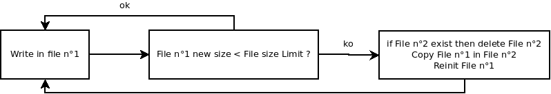

Platform : Log storing internal API and implemetation details
=============================================================

This page last changed on Jan 27, 2011 by lbarthelemy.

Implementation organization
===========================

Global organization
-------------------

2 logical blocs:

bloc

functions / features / API

Lua module

-   API and implementation shared between Linux and Open AT
-   Main configuration : Flash/Ram size occupation, ...
-   Log policies

C-Lua lib

-   Shared API but different implementations for Linux and Open AT
    -   init
    -   Ram/Flash write
    -   Ram/Flash retrieve / stream logs \
         Retrieving/streaming logs re-initializes/erases the
        corresponding buffer (Ram/Flash).

Usage Logic : Ram is used as **context**, Flash is used to persist
context bloc on specific **events** (log policies definition).\
 Eventually, on debug purpose, flash can also be used to store all logs

#### Low Level API for logs in Ram

lograminit({size=number}):\
 size: ram buffer size in bytes, must be less than 2048.\
 returns "ok" for successful init, "lograminit: init already done" if
init was already done, and nil + error string when a error occurs.

logramstore(buffer):\
 buffer: string to store in ram buffer. String size must be in ]0,
rambuffersize [\
 If store needs to erase some data in RAM buffer to write new buffer,
then a signal is emitted: emitter ="logramstore", event = "erasedata".\
 returns "ok" on successful call, and nil + error string when a error
occurs.

logramget():\
 return a string with all logs as a single string\
 When call is successful, the ram buffer is re-initialized (empty).\
 returns string containing logs on successful call, and nil + error
string when a error occurs.

#### Low Level API for logs in Flash

initflashlog({size=number, path=string})\
 size -\> maximum flash size to be used for storing logs\
 path -\> only for Linux implementation, path to folder where to store
the logs, this must be a valid path of flash filesystem.\
 returns "ok" for successful init, "logflashinit: init already done" if
init was already done, and nil + error string when a error occurs.

For Linux implementation: the provided path has to remain the same
between successive inits if previous logs need to be retrieved.

**note**: if maxflashsize requested at init is superior than current
flash size used, then during first write in flash, flash size used will
be reduced to match maxflashsize.

storeflashlog(buffer):\
 buffer: string to store in ram buffer. String size must be in ]0,
rambuffersize [\
 returns "ok" on successful call, and nil + error string when a error
occurs.\
 stream/source ltn12:

logflashgetsource()\
 returns one of those:

-   a ltn12 source that allows to stream the **whole** content of logs
    stored in flash
-   ltn12.source.string("nothing to read") is returned when no log is
    stored in flash
-   nil + err string is returned on error,\
     After successful call, flash space is re-initialized (empty).

Limitation: the case where log is being written in flash while content
streaming is in progress is NOT MANAGED.

Implementation details
----------------------

#### Common logram implementation

-   Shared code for Open AT / Linux
-   Single Ram buffer
-   Logs stored using string "objects" (stringsize on 2 bytes, string
    content).

#### Linux logflash implementation

-   Logs are stored using **2 "rotating" files**: log rotation is done
    by file duplication:\
     

-   **ltn12 source** is done using: ltn12.source.cat
    (ltn12.source.file(file\_older\_logs),
    ltn12.source.file((file\_recent\_logs) )

File write **flushing** is configurable by define in C code, systematic
file write flush activated by default.\
 C Define to be adapted depending on target embedded (file)system.

#### Open AT logflash implementation

-   Logs are stored using **single flash object page**.
-   Number of flash object fixed at 256, but **only 255 IDs are usable**
    to store logs (see below for explanation).
-   One flash ID can contain several logs.
-   Flash object IDs are used by **rotation**.

    

    Two cases may produce some flash object IDs erasure: no more free
    IDs to store news logs or/and global flash space used to store logs
    overruns maxflashsize limit.\
     The oldest logs are always erased first.

-   Storing a buffer (of logs) in flash only trigger one flash write.
-   Indexes used as bounds to move in flash page, are computed at init
    and then maintained in Ram.\
     Bound indexes are computed using the presence of a "hole" in the
    page: i.e. contiguous flash object ID(s) in flash page with no
    data.\
     This hole is always made of, at least, one ID.\
     Then bound indexes are defined like this:
    -   most recent log is the first log/Id before the hole,
    -   older log is the first log after the hole \
         **note** Given Flash object "rotation", the hole can be located
        both at the beggining and the end of the flash object page, so
        "after" and "before" terms are to be understand relatively to
        the hole, not as absolute values.

-   **ltn12 source** is done using : C-Lua function working with
    upvalues defining indexes of the flash objects to read in order to
    stream the flash page.

Attachments:
------------

[Diagram1\_log.png](attachments/24743783/21528604.png) (image/png) \
 
[Diagram1\_log.png](attachments/24743783/21528603.png) (image/png) \

Document generated by Confluence on Mar 11, 2013 16:15
