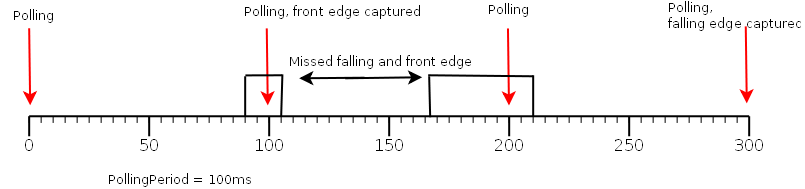

Platform : Monitoring load and performance tests
================================================

This page last changed on Oct 15, 2010 by bcabe.

The purpose of this page is to present the results of the monitoring
load & performance tests done with M2MBoxPro.

Memory usage
------------

Following memory usage are computed after 5 successive garbage collect.

Tests \

total script size (bytes) \

Size (Kb) \

lua\_vm \

0 \

138 \

Agent (without Monitoring module loaded) \

0 \

326 \

Monitoring loaded \

0 \

341 \

Monitoring + 1 script \

176 \

342 \

Monitoring + 1 script + gpio module loaded \

176 \

343 \

Monitoring + 10 scripts \

2155

371 \

Max measured memory during execution of 30 scripts \

4575 \

417

With lua vm default config, the maximum memory that the lua vm can use
is about 470kb. If the used memory exceed 470kb, the device will reboot.

Tests scripts can be found in
[attachment](attachments/15008167/15138850.lua) .

GPIO Management
---------------

#### I/O Perferormed Tests

###### openAT limitation.

When a subscription to GPIO service is done, a GPI polling period (P)
has to be specified. This period has not to be lower than 100ms
otherwise the device may reboot on heavy operations.

As a consequence&; all glitches with a duration less than 100ms may be
not captured by the running openAT application.

Because some glitches may be lost, it's not possible to measure
precisely glitch duration.

Moreover, depending of scheduled tasks, the openAT OS does not guarantee
that subscribed GPIOs will be polled exactly every P ms. As a
consequence we have to add a variable latency period to the real polling
period.

[mTest.lua](attachments/15008167/15138866.lua)

#### Delay in monitoring.

This test consists to compute the delay that lua takes to capture the
changement of a digital input and the writing of this new input value to
a digital output.

The measured time is the difference between the C 'gpio\_write'
operation and the time when the C captured the new value of this input.

On the nominal case, this action takes less than 10ms, but it may depend
of the number of scripts that have to be executed before.

Because monitoring scripts are executed in the order that they have been
added, if 2 (or more) scripts are listening our DI, the first executed
script will the first added script. For example, First you add to
monitoring module a script that sends an event to the server on each
front edge of on input and then we had our script that write new value
of this input to an output. Here, on each DI front edge, an event will
be sent to ther server, if the connection takes 800ms, our script will
be executed 800ms later. As a consequence the measured time will be
810ms. But whatever is the delay is, no GPIO events will be lost by the
system even if many events occurred on the same DI.

Note: Because the 4 analogs inputs are multiplexed on same GPOs, only
one analog can be polled by polling period.

#### I/O Conclusion

Polling GPI period has to be equals or upper to 100ms.

Glitch duration can not be computed precisely.

Monitoring script execution with GPIO read / write operation takes less
than 10msComplete cycle is variable, it depends of : the GPIO polling
period, the number of monitoring scripts that have to be executed and
the scheduling of C tasks .

AnalogInput polling period can be less than 4 \* 100ms = 400ms

A set of used scripts is available
[here](attachments/15008167/15138866.lua)

Modbus application
------------------

#### First step:

The following application has been implemented for a first set of tests
:

A monitoring script makes periodically **NR** modbus request of **NW**
words of 16 bits. Those **NR\*NW** words are stored in a simple database
(in ram).

On each request :

-   If the first word change, an event is sent to the platform
-   for the 4 others words an event is sent if one of them exceed a
    threshold value.

Every **PT** seconds, the application send all read words to the server.

Moreover on rising edge of the digital input 1, or if the analog input 1
exceed a threshold, an event is sent to the server.

A first test shows that the number of lua modbus request that can be
executed in one minute is:

-   1000 requests if we read 2 registers
-   700 requests if 10 registers are read
-   486 requests if 20 registers are read
-   306 requests if 40 registers are read

A first test with NR = 5, NW = 20, PT = 120 has been performed:

-   The initial memory used is 390kb.
-   Each times the 5 modbus request are done, the memory increase of
    2kb.
-   When data are sent to server (and freed from the RAM), memory
    decrease to 400kb.

=\> As a consequence, with this configuration, data can not be kept in
RAM more than 6 minutes, otherwise the maximum memory that lua can used
will be reach.

A test with just the reading task has been performed with NR = 5 and NW
= 40

-   The initial memory used is 378kb
-   Memory used increase progressively: (data are never flushed)
    -   after 300 sec memory used is 440kb =\> device reboot 2 or 3
        minutes later

with NR = 5 and NW = 20

-   The initial memory used is 378kb
-   Memory used increase progressively: (data are never flushed)
    -   after 300 sec (150 reads) sec memory used is 407kb
    -   after 600 sec (300 reads) sec memory used is 480kb =\> device
        reboot after few seconds later

=\> In both cases, no I/O events are lost.

=\> There is a real need to store read data in flash or to sent them
regularly to the server...

scripts are available in
[attchements](attachments/15008167/15138867.lua)

#### Second step:

Same application has been developed except that instead of watching the
value of 4 words, 10 words are monitored.

Moreover:

-   on datawriting 5 writing request of 10 words are performed.
-   on a specific command, 5 writing request of a single word are
    performed.
-   Battery level, power supply and gsm strength are monitored

=\> We have **NR** \* (10 + 1) + 3 = 58 monitored variables.

###### Nominal case: ( **NR** = 5, 6, 7, 8, 9, 10; **NW** = 20, 40, 50, 60; **PT** = 10s; monitored vars still 58)

-   Initial used memory : 395kb
-   Memory still stable while no events occurred.
-   When an event occurred memory increased slowly depending the number
    of events (Input / words thresholds...)
    -   If too many events occurred simultaneously memory grows fast. If
        there is more than 11 events, the memory taken by lua exceed
        470bytes. =\> device may reboot.

=\> Number of modbus request (**NR**) and read words (**NW**) does not
impact significantly used memory

=\> **PT** may be not guarantee if heavy operation, connection to server
for example, are performed.

###### Test with **NR** = 5; **NW** = 20; **PT** = 5 ,7s, monitored vars still 58

-   Initial used memory : 395kb
-   Memory still stable while no events occurred.
-   On event, more read task are executed with a little delay than
    previous test =\> More events may be lost
-   When an event occurred memory increased slowly depending the number
    of events (Input / words thresholds...)
    -   If too many events occurred simultaneously memory grows fast. If
        there is more than 11 events, the memory taken by lua exceed
        470bytes. =\> device may reboot.

=\> **PT** may be not guarantee if heavy operation, connection to server
for example, are performed.

###### Test with NR = 5; NW = 20; **PT** = 2s monitored is 58

-   Initial used memory : 395kb
-   Memory still stable while no events occurred.
-   Read task are executed with more delay =\> More events may be lost
-   When events occurred simultaneously, memory increased **fast** and
    device reboot

###### Test with NR = 5; NW = 20; PT = 2s monitored variables is 33

-   Initial used memory : 395kb
-   Memory still stable while no events occurred.
-   Read task are executed with delay =\> More events may be lost
-   When events occurred simultaneously, even if the lua vm exceed 470kb
    fast, the memory increased **slowly than previous test** (reboot is
    not systematics)

=\> The more **PT** is low, more reading task may be shifted and more
event may be lost.

=\> Monitored variables impact the used memory

###### Test with a single connection

A last test, with only one connection instead of one by event shows that
whatever is **PT** the memory used by lua vm still stable (between 395
and 410kb) even if all events occurred 'simultaneously'

###### High speed test

An application that read 64 registers on 3 requests every seconds and
send all read words to the server every 2 minutes has been developed.

Results:

-   Initial used memory : 350kb
-   Read task are executed with delay =\> Events may be lost
-   Memory increases fast : 7kb every 10 seconds

=\> after 1 minute, used memory is about 420kb, data need to be sent to
server in order to keep enough free memory.

With a reed period equals to 2 seconds

-   Initial used memory : 350kb
-   Read task are executed with less delay =\> less events may be lost
-   Memory increases fast : 3kb every 10 seconds

=\> results are proportional, data need to be sent every 2 minutes

##### Step 2 conclusion:

Read words and modbus request are not the limiting factor. The limiting
factor is the number of tasks that have to be executed "simultaneously "
and their execution time.

Today, in monitoring, the only 'heavy' task is the connection to server
task. An optimization on script or in the monitoring side can reduce
significantly problems that generate several server connection.

**PT** may be not guarantee on heavy tasks.

#### Modbus Conclusion

There is two limiting factors :

-   the store of read data.
-   number of task executed simultaneously and their execution time.

At this step, on the nominal case (**NR** = 5, **NW** = 20, **PT** =
10s) , the only problem is the number of events that can be raised in a
very short time and the number of connection to server that may
generate.

With **PT** less than 5s some events may be lost even if no heavy
operation are performed.

Attachments:
------------

[Diagramme1.png](attachments/15008167/15138848.png) (image/png) \
 
[Diagramme2.png](attachments/15008167/15138849.png) (image/png) \
 
[memTest.lua](attachments/15008167/15138850.lua)
(application/octet-stream) \
 
[mTest.lua](attachments/15008167/15138866.lua)
(application/octet-stream) \
 
[modbus.lua](attachments/15008167/15138868.lua)
(application/octet-stream) \
 
[modbus.lua](attachments/15008167/15138867.lua)
(application/octet-stream) \

Document generated by Confluence on Mar 11, 2013 16:16
