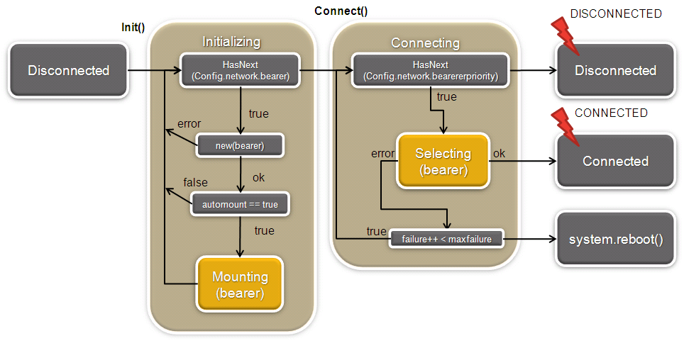
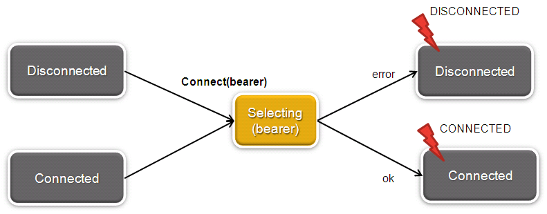
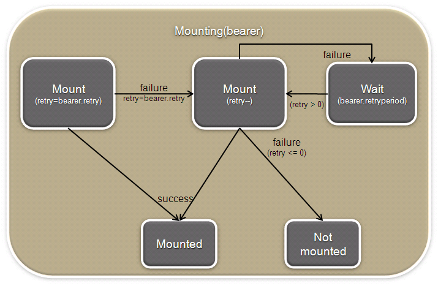
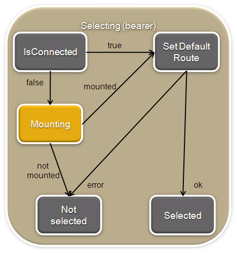
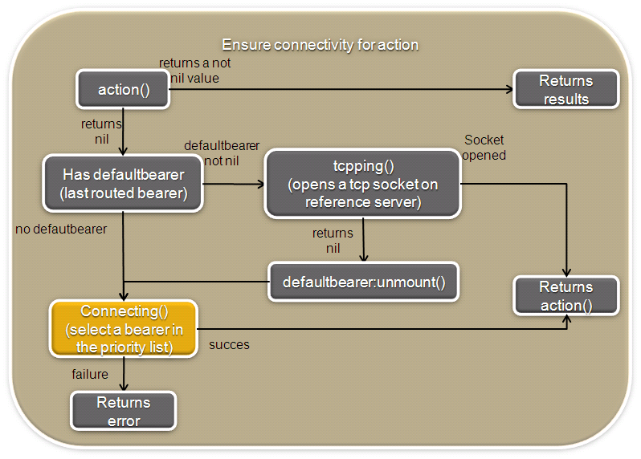
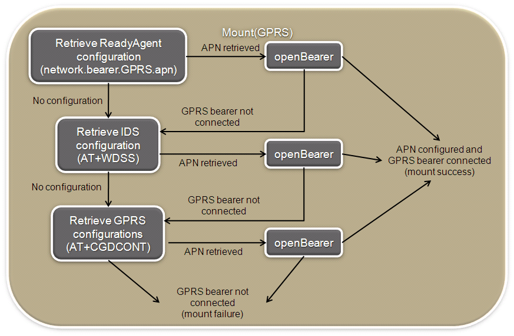

Platform : Network Manager
==========================

This page last changed on Sep 07, 2012 by bcabe.

Overview
========

The NetworkManager is responsible for initializing bearers and selecting
the appropriate one for external communications.

Configuration
=============

The NetworkManager configuration parameters are listed under the item
network in the ConfigStore:

-   network.activate = true, enable / disable the NetworkManager. If
    activated, the NetworkManager will be automatically started.
-   network.maxfailure = 2, if defined this value specifies the number
    max of failure before reboot on bearer selection (see Connecting
    state of figure 1).
-   network.bearerpriority = {"GPRS", "ETH"}, list of available bearers
    ordered by priority. The NetworkManager will search, in this list,
    for the first appropriate bearer for external communications.
-   network.maxconnectiontime = 300, \**[OPTIONAL can be overridden per
    bearer]*\* maximum connection time for a bearer selected in the
    bearerpriority list if not the first of the list.
-   network.retry = 5, ***[OPTIONAL can be overridden per bearer]***
    number of retries before trying to connect to the next bearer in
    list.
-   network.retryperiod = 10, ***[OPTIONAL can be overridden per
    bearer]*** number of seconds to wait before retrying to connect to a
    bearer
-   network.smsfallback = "+33102345879", activate / deactivate (if nil)
    the sms fall back mode
-   network.pinghost = "www.google.com", host for tcpping
-   network.pingport = "www.google.com", port for tcpping

Other settings are bearer specific and in the general form of
network.bearer.BEARERNAME.bearersetting

-   network.bearer.GPRS ={apn = "some APN", username = "an optional
    username", password = "an optional password", retry='an optional
    retry', retryperiod='an optional retry period'}
    -   if no apn is define, the GPRSbearer behavior depends of the
        target.

-   network.bearer.ETH = { mode= "dhcp", retry='an optional retry',
    retryperiod='an optional retry period'} }
-   or network.bearer.ETH = {mode = "static", address = "10.0.0.189",
    netmask = "255.255.0.0", broadcast = "10.0.255.255", gateway=
    "10.0.0.254", nameserver1 = "10.6.0.224", nameserver2 =
    "10.6.0.225", retry='an optional retry', retryperiod='an optional
    retry period'} }

If network.retry and network.retryperiod are not specified, specific
bearer configuration is **mandatory**

Architecture
============

The NetworkManager is composed of two modules:

-   NetworkManager, which holds all the connection logic, mainly
    initializing and selecting the appropriate bearer.\
     This module is the interface of the NetworkManager.
-   Bearer, which represents and monitors a physical bearer, mainly
    mounting and unmounting a physical bearer.\
     This module is not intended to be used by a client.

Functionalities
===============

The following diagram presents the initialization of the NetworkManager
(network.activate = true).\
 \
 Figure 1: NetworkManager init()

-   The NetworkManager is started in a **disconnected** state
-   When the ReadyAgent starts up, if ConfigStore parameter
    network.activate is true, the NetworkManager is required and the
    init() function is called
-   The init function initializes one at a time each bearer declared in
    the ConfigStore (network.bearer.BEARERNAME)
-   The connect function searches according to the
    network.bearerpriority list an available bearer for external
    communications.
-   If an appropriate bearer is found the NetworkManager emits the
    signal (CONNECTED), if not (DISCONNECTED).
-   The NetworkManager will trigger a reboot when the number of failure
    equals maxfailure (only if maxfailure is defined in the
    ConfigStore).

The NetworkManager allow to connect a specific bearer at anytime. The
following diagram illustrates this feature.\
 \
 Figure 2: NetworkManager connect(bearer)

The Mounting and Selecting stages are describes and the two following
diagrams\
 \
 Figure 3: NetworkManager mount()\
 \
 Figure 4: NetworkManager select()

Server connection
-----------------

The NetworkManager first mission is to ensure connectivity for a
communication action (i.e communication to the server).\
 The following figure illustrates the connection algorithm.\
 \
 Figure 5: Ensure connectivity for a communication action

Bearers specifics
=================

OpenAT GPRS bearer
------------------

By default, the GPRSBearer takes its parameter from the ReadyAgent
configuration file. On openAT devices, if no APN is defined into that
file, the bearer will try to use pre-configured APN stored in the
device.

The first preconfigured APN used is the dedicated APN used to
communicate with IDS, if it's not configured or if the connection
failed, the bearer will try with the 3 first APNs configured with the
at+cgdcont AT command.

The following diagram presents the APN selection for the openAT GPRS
bearer.\
 \
 Figure 6: apn selection

NetworkManager API
==================

Functions calls
---------------

-   init(), initializes the NetworkManager and all bearers.
-   connect(nil or bearername, check\_route), tries to connect to the
    given bearer (if bearername is specified) or tries to connect to a
    bearer from the *network.bearerpriority* list (selecting the first
    appropriate bearer).\
     If a connection is established the CONNECTED signal is raised (see
    [events](Network%2BManager.html)).\
     If check\_route equals true, the selected bearer will be tested to
    see if a external communication is possible, In this case if the
    connection failed the DISCONNECTED signal is raised.
-   getStatus(): return current bearer and current mode (auto or manual)
-   tryConnectedAction(action, ...) returns action(...) results when the
    network is working and nil followed by an error on network error.
    I.E it returns the results of the function action() if its first
    result is non nil, otherwise try to verify/remount the network
    connection

Events
------

\
 It raises specifics events on connection / deconnection:

-   on connection =\> signal("netman", "CONNECTED", *bearername*)
-   on disconnection =\> signal("netman", "DISCONNECTED")

where *bearername* can be GPRS, ETH...\
 All those events are raised with "netman" as emitter

Bearers API
===========

Function calls
--------------

Bearers are instancied and initialized by the NetworkManager. They must
provide following functions:

-   new(bearername, automount), returns an new bearer instance of
    'bearername' bearer. initparams is a table that will be given as
    parameter (key=value) when initializing the bearer shell script\
     If automount equals true, the bearer will be automatically mounted
    if disconnected.
-   mount(), mounts the connection (unmount and mount)
-   isconnected(), returns a boolean stating the connection status
    (false: not connected, true: connected)

Linux target specific bearer executables
----------------------------------------

In order to do the real work the bearer instance call an executable to
mount/unmount the Linux network interface. The executable name is the
bearer name: BEARERNAME, like: ETH or GPRS.

Those executables are meant to be target specific, while bearer instance
logic must be related to embedded system only.\
 Those executables must use system status code and stdout to sent data
to bearer instance within ReadyAgent.\
 As the only constraint is to be executable, those features can be done
by a shell script (like those provided in ReadyAgent), or using any
other language that produces linux executable.

-   Executables are to be put in **bin** directory in ReadyAgent runtime
-   Executables must have correct access permissions.
-   All parameters are given to executables using shell command line.
    Example: ./bin/ETH cmdname param1 param2 param3
-   Output data are all **mandatory** (unless otherwise specified)
-   Output data on stdout can be set to **NULL** value to specified that
    a data can not be retrieved. Example: in a shell script: echo
    "outputdata1" "NULL" "outputdata3", set data 2 to NULL.

The script take a "command" as first parameter. Depending on the
command, more parameters may follow.

-   **init**: initialize the network interface parameters.
    -   params: It takes as argument some specifics configuration like
        PIN number, GPRSAPN...
    -   stdout: the name of the corresponding Linux network interface
    -   exit status: 0 if bearer init was successful, a positive value
        in case of error

-   **start**: mount the network interface (synchronous).
    -   params: the name of the linux interface to be mounted (returned
        by the init method)
    -   stdout: IP address, Hardware Address (MAC address), netmask,
        gateway (ip), dns1 (ip), dns2 (ip), ..., dnsn (ip)
    -   exit status: 0 if the network is mounted or a positive value in
        case of error

-   **stop**: unmount the network interface (synchronous).
    -   params: the name of the linux interface to be mounted (returned
        by the init method)
    -   stdout: N.A.
    -   exit status: 0 if the network is unmounted or a positive value
        in case of error

-   **default**: set the bearer as default route
    -   params: interface name, gateway address, dns address(es)
    -   stdout: N.A.
    -   exit status: 0 if the action is successful or a positive value
        in case of error

-   **stats**: get dynamic statistics of the bearer
    -   params: interface name
    -   stdout: RX bytes, TX bytes
    -   exit status: 0 if the action is successful or a positive value
        in case of error

Attachments:
------------

[automatic\_statechart.pptx](attachments/12453019/18317340.pptx)
(application/vnd.openxmlformats-officedocument.presentationml.presentation)
\
 
[automatic\_statechart.png](attachments/12453019/18317355.png)
(image/png) \
 
[automatic\_statechart.pptx](attachments/12453019/18317354.pptx)
(application/vnd.openxmlformats-officedocument.presentationml.presentation)
\
 
[automatic\_statechart.pptx](attachments/12453019/21528775.pptx)
(application/vnd.openxmlformats-officedocument.presentationml.presentation)
\
 
[automatic\_statechart.png](attachments/12453019/21528774.png)
(image/png) \
 
[oatGPRS\_statechart.png](attachments/12453019/18317376.png) (image/png)
\
 
[oatGPRS\_statechart.pptx](attachments/12453019/18317377.pptx)
(application/vnd.openxmlformats-officedocument.presentationml.presentation)
\
 
[automatic\_statechart.png](attachments/12453019/21528776.png)
(image/png) \
 
[automatic\_statechart.pptx](attachments/12453019/21528777.pptx)
(application/vnd.openxmlformats-officedocument.presentationml.presentation)
\
 
[automatic\_statechart.png](attachments/12453019/21528778.png)
(image/png) \
 
[automatic\_statechart.pptx](attachments/12453019/18317338.pptx)
(application/vnd.openxmlformats-officedocument.presentationml.presentation)
\
 
[automatic\_statechart.png](attachments/12453019/18317339.png)
(image/png) \
 
[connect.PNG](attachments/12453019/23396579.png) (image/png) \
 
[init.PNG](attachments/12453019/23396577.png) (image/png) \
 
[mount.PNG](attachments/12453019/23396559.png) (image/png) \
 
[select.PNG](attachments/12453019/23396560.png) (image/png) \
 
[netman.pptx](attachments/12453019/23396573.pptx)
(application/vnd.openxmlformats-officedocument.presentationml.presentation)
\
 
[netman.pptx](attachments/12453019/23396576.pptx)
(application/vnd.openxmlformats-officedocument.presentationml.presentation)
\
 
[gprs.PNG](attachments/12453019/23396575.png) (image/png) \
 
[gprs.PNG](attachments/12453019/23396574.png) (image/png) \
 
[netman.pptx](attachments/12453019/23396578.pptx)
(application/vnd.openxmlformats-officedocument.presentationml.presentation)
\
 
[init.PNG](attachments/12453019/26804630.png) (image/png) \
 
[netman.pptx](attachments/12453019/23396580.pptx)
(application/vnd.openxmlformats-officedocument.presentationml.presentation)
\
 
[connect.PNG](attachments/12453019/23396557.png) (image/png) \
 
[netman.pptx](attachments/12453019/24903838.pptx)
(application/vnd.openxmlformats-officedocument.presentationml.presentation)
\
 
[netman.pptx](attachments/12453019/26804631.pptx)
(application/vnd.openxmlformats-officedocument.presentationml.presentation)
\
 
[tryConnected.PNG](attachments/12453019/24903839.png) (image/png) \
 
[init.PNG](attachments/12453019/23396558.png) (image/png) \
 
[netman.pptx](attachments/12453019/23396561.pptx)
(application/vnd.openxmlformats-officedocument.presentationml.presentation)
\

Document generated by Confluence on Mar 11, 2013 16:16
