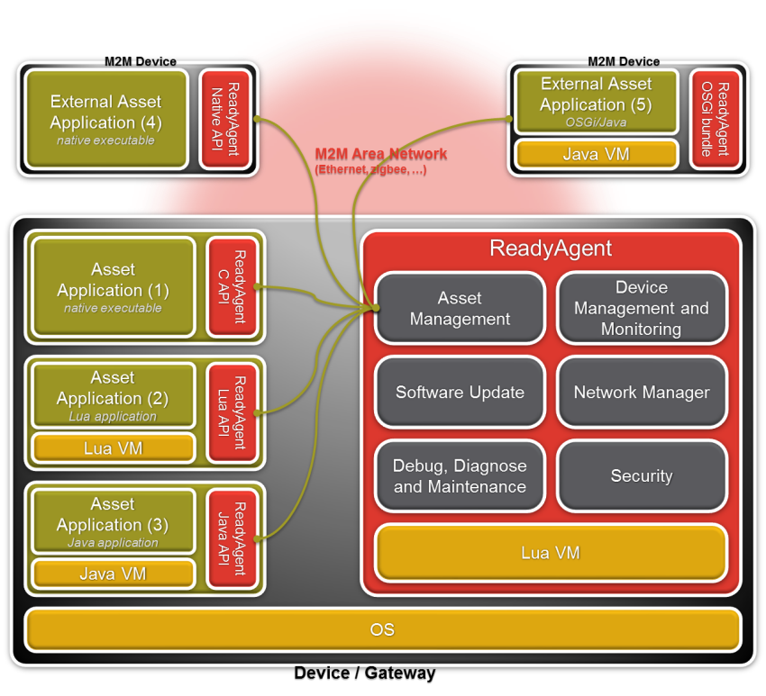

Platform : ReadyAgent - UserGuide
=================================

This page last changed on Mar 06, 2013 by lbarthelemy.

Document History
----------------

Date

Version

Author

Comments

11/11/08

Draft

D. FRANCOIS

Document creation

04/09/09

Draft

D. FRANCOIS

Full update

21/04/09

1.0

C. BUGOT

Remove language examples (they are factorized into code samples) \
 Add more general information on the libraries

30/04/09

1.0

C. BUGOT

Add information on software update and OSGi bundle

31/03/10

2.0

C. BUGOT

Changes the template of the document \
 Add new features from the Agent libraries

30/06/10

2.1

C. BUGOT

Minor edits for ReadyAgent R2.0 Release

19/09/11

3.0

L. BARTHELEMY

Refactor of the document format (wiki) \
 Replace AwtCom and AwtDaHL libs by Racoon library

21/05/12

3.1

L. BARTHELEMY

Replace Racoon library by Airvantage embedded library

06/03/13

3.2

L. BARTHELEMY

Update to fit current API's: C API is available, Java API is deprecated

Reference Documents
-------------------

REF-1

[M3DA Protocol
Specification](https://confluence.sierrawireless.com/display/PLT/M3DA+Protocol+Specification)

REF-2

Java API: javadoc

REF-3

C API: doxygen

REF-4

Lua API: luadoc

REF-5

[Monitoring Engine](Monitoring.html)

REF-6

[ReadyAgent Configuration](ConfigStore.html)

Table of Content
----------------

-   [Document History](#ReadyAgent-UserGuide-DocumentHistory)
-   [Reference Documents](#ReadyAgent-UserGuide-ReferenceDocuments)
-   [Table of Content](#ReadyAgent-UserGuide-TableofContent)

[1. Introduction](#ReadyAgent-UserGuide-Introduction)

[2. Plateform Overview](#ReadyAgent-UserGuide-PlateformOverview)

-   [2.1. General
    Architecture](#ReadyAgent-UserGuide-GeneralArchitecture)
-   [2.2. Embedded
    Architecture](#ReadyAgent-UserGuide-EmbeddedArchitecture)
-   [2.3. Embedded Agent](#ReadyAgent-UserGuide-EmbeddedAgent)
-   [2.4. User Library](#ReadyAgent-UserGuide-UserLibrary)

[3. Airvantage embedded
library](#ReadyAgent-UserGuide-Airvantageembeddedlibrary)

[4. Code Sample](#ReadyAgent-UserGuide-CodeSample)

1. Introduction
===============

This document explains the usage of the Platform Embedded API
(Application Programming Interface). The API is planned to be available
in several programming languages and programming patterns: Java, C
Asynchronous, C Synchronous, and Lua. The aim is to be generic, but
whenever it is necessary, language specific notes can still be present
in this document.

In order to be more concrete, a code sample for every programming
language/pattern is provided along with this document.

2. Plateform Overview
=====================

2.1. General Architecture
-------------------------

The platform enables applicative data management, device management, and
an easy way to configure a set of devices according to costumer needs.\
 The platform can be divided into two parts: the platform server and the
device side. Here is a simple representation of those two sides.

The embedded application encodes the data and events and sends them to
the embedded ReadyAgent through an IPC (e.g. a socket). The agent adds a
message envelope (compression, authentication, etc.), and sends it to
the platform server through HTTP or another transport protocol.

The platform server front-end receives and decodes it, and sends it to
the application data store where data and events will be stored.

2.2. Embedded Architecture
--------------------------

The next figure illustrates the typical embedded architecture on a Linux
target.\
This architecture is composed of the ReadyAgent, ReadyAgent libraries,
and one or more applications.

The ReadyAgent may run in a different process (as a daemon) or be
statically linked in a monolithic software.

2.3. Embedded Agent
-------------------

The embedded ReadyAgent is in charge of dispatching incoming messages to
applications and sending user applicative data and events to the
platform server. The exchange between applications and the ReadyAgent is
done through an IPC. This guaranties a high separation between
application code and system code.

Before sending a message to the server, the agent adds a message
envelope (compression, authentication, headers, etc.). All data received
by the Agent has to be serialized according to the protocol
specification described in document
[\#REF-1](ReadyAgent%2B-%2BUserGuide.html). This serialization is done
by the Airvantage Connector library described below.

2.4. User Library
-----------------

The user library is named Airvantage Connector and addresses several
needs:

-   It enables communication with the ReadyAgent. It is an abstraction
    of the IPC used to communicate with it
-   It provides Device Management features like ReadyAgent tree access
    (including its configuration)
-   It provides data sending/receiving APIs
-   It automatically serializes the data to be sent to the Server
    through the ReadyAgent. It handles all the complexity of the AWTDA
    protocol structure
-   It abstracts system dependent features likes SMS, Reboot, etc.

3. Airvantage embedded library
==============================

See [Airvantage embedded library page](Airvantage%2BLua%2Blibrary.html).

4. Code Sample
==============

The code samples show how to use the Airvantage Connector library in
different programming languages. The implemented application simulates
an asset called "house" with two rooms. Some data and events are sent
for those two rooms.

While starting, the asset sends an event, indicating status "booting",
and a timestamp to the server.

The bedroom temperature is sent three times, with heating preset value
(constant value here) and timestamp. An event "Temperature too hot" is
sent when the room temperature crosses an alarm threshold.

The livingroom temperature is sent five times with timestamps.\
 The event "Window opened" is also sent five times. This event is not
related to the room temperature.

A specific Command listener waits for a Command reception named
"stopheating" on the asset "house", and a trace prints the data embedded
within the received command.

The given code samples use as few as possible system calls in order to
simplify the understanding of the Airvantage Connector library. All
actions thus happen synchronously. \
 For the same reason, the time elapsing is basically simulated so that
timestamps are not all identical. More practical applications will use
periodic timers, event driven actions, etc.

Application Data Model:

Path

Data structure

Period and/or number of occurrence

Values

Policy

house.event

status, timestamp

on boot

{"booting", timestamp}

"now"

house.bedroom.data

temperature, preset, timestamp

1 sec, 3 times

{19,19, timestamp}, {12, 19, timestamp} , {17, 19, timestamp}

"hourly"

house.bedroom.event.temptoolow

temperature, alarm\_temperature, timestamp

one time

{12, 19, timestamp}

"now"

house.living-room.data

temperature, timestamp

1 sec, 5 times

{16, timestamp}, {17, timestamp}, {18, timestamp}, {17, timestamp}, {19,
timestamp}

"hourly"

house.living-room.event.windowopened

status, timestamp

one time

{"open", timestamp}

"now"

-   Previous model use "data" and "event" sub paths to help in the
    differentiation of events; this is only to improve readability of
    the sample.
-   A platform server model corresponding to the code sample is
    available, and is to be provided along with the code sample source
    code.

Attachments:
------------

[Device.png](attachments/35718240/35815625.png) (image/png) \
 
[Device\_server.png](attachments/35718240/35815626.png) (image/png) \

Document generated by Confluence on Mar 11, 2013 16:17
