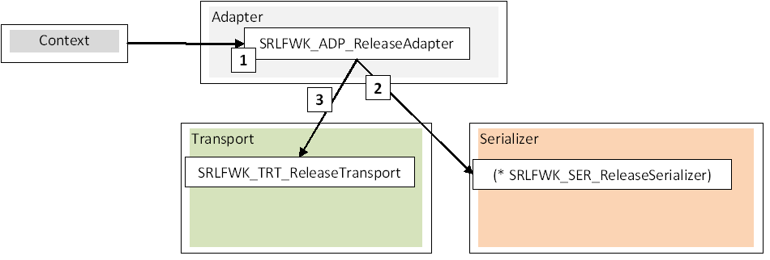

Platform : Serial Protocol Framework
====================================

This page last changed on Mar 03, 2011 by gilles.

1.Introduction
==============

1.1.Purpose
-----------

This document describes the Serial Framework protocol concepts.

1.2.Overview
------------

This framework must be seen as a design pattern, a tool box which aims
at formalizing all the concepts of a serial protocol.\
 At this point a serial protocol defines request and response frames
sent and received through the serial capabilities of a target which is
either Linux or Open AT.\
 The serial framework is composed of fives entities:

-   Types
-   Context
-   Serializer
-   Transport
-   Adapter

The **Types** holds the static types related to the serial protocol (the
enumeration, the constant definitions). The types should be target
independent.\
 The **Context** is mainly responsible for holding all the memory
structures to prepare, send, receive, and parse data. The context
contains references to the other entities of the serial stack.\
 The serial stack context is composed of a serializer object, a
transport object and all the necessary target dependant glue variables.\
 The **Serializer** is in charge of creating and parsing serial frames.
The **Serializer** is a reusable layer and must be target independent.\
 The **Transport** manages transmission and reception the serial frames.
The **Transport** is tightly linked to the underlying target (either
Linux or Open AT). The **Transport** must be serial stack independent. \
 The **Adapter** links a serializer to the transport layer. Tha
**Adapter** is target dependant but protocol independant.

This document describes the target dependent entities with examples base
on openAT.

1.3.Architecture for a C implementation
---------------------------------------

The following diagram represents a high level view of the Serial
Protocol Framework.\
 \
 Figure 1: Global architecture of the Serial Protocol Framework

2.Types
=======

2.1.Overview
------------

The **Types** layer is composed of all the constants related to the
serial protocol. These constants are supposed to be visible by the end
user.\
 This module is target independent.

2.2.Simplified view
-------------------

The types are simply enumerations, constants and defines.

~~~~ {.theme: .Confluence; .brush: .java; .gutter: .false
style="font-size:12px;"}
/* defines */
#define SERIAL_PROTOCOL_TYPE_YYY 3

/* enums */
typedef enum {
    SERIAL_PROTOCOL_CMD_1 = 0x01,
    SERIAL_PROTOCOL_CMD_2 = 0x02,
} FunctionCodes;
typedef enum {
    SERIAL_PROTOCOL_RETURN_CODE_1,
    SERIAL_PROTOCOL_RETURN_CODE_2,
} ReturnCodes;
~~~~

3.Context
=========

3.1.Overview
------------

The **Context** links a protocol serializer and the transport layer.

3.2.Simplified view
-------------------

~~~~ {.theme: .Confluence; .brush: .java; .gutter: .false
style="font-size:12px;"}
/* openAT callback */
typedef void (* SRLFWK_ADP_ResponseHandler)(SerialContext* pSerialContext, AwtStatus status, void* pUserData);

struct SerialContext_ {
    /* serializer */
    Serializer serializer;

    /* transport */
    SerialOatTransport transport;

    /* target dependent */
    SRLFWK_ADP_ResponseHandler responseHandler; // response handler
    void* pUserData; // pointer to user data
};
~~~~

The context structure is pre-declared in the **Types** layer but
explicited in the **Adapter**.

4.Serializer
============

4.1.Overview
------------

The **Serializer** implements a serial protocol. A protocol serializer
defines the requests and parses the responses for a considered
protocol.\
 The serializer module defines the serializer structure type which is
mainly composed of:

-   3 buffers (request, response, temp) initialized when the serial
    stack is opened,
-   mandatory functions to allow a simple connection to the transport
    and adapter layers,
-   protocols specific variables.

This module is target independent.

4.2.Simplified view
-------------------

~~~~ {.theme: .Confluence; .brush: .java; .gutter: .false
style="font-size:12px;"}
struct Serializer_;
typedef struct Serializer_ Serializer;

/* initialize */
typedef AwtStatus (* SRLFWK_SER_InitSerializer)(Serializer* pSerializer, void* pSerializerData);
/* release all allocated resources */
typedef void (*SRLFWK_SER_ReleaseSerializer)(Serializer* pSerializer);
/* builds requests */
typedef AwtStatus (*SRLFWK_SER_RequestBuilder)(Serializer* pSerializer, void* pRequestData);
/* verify on the fly the response buffer and returns true if this buffer contains a complete response */
typedef uint8_t (*SRLFWK_SER_IsResponseComplete)(Serializer* pSerializer);
/* check the response buffer and compute a status */
typedef AwtStatus (*SRLFWK_SER_ResponseChecker)(Serializer* pSerializer);
/* analyze the response buffer to compute a status and extract all required data */
typedef AwtStatus (*SRLFWK_SER_ResponseAnalyzer)(Serializer* pSerializer, AwtStatus status);
/* retrieve request and response buffers */
typedef AwtStatus (* SRLFWK_SER_GetRequestPDU)(Serializer* pSerializer, uint8_t** ppBuffer, uint16_t* pBufferLength);
typedef AwtStatus (* SRLFWK_SER_GetResponsePDU)(Serializer* pSerializer, uint8_t** ppBuffer, uint16_t* pBufferLength);
/* get length of an anticipated response */
typedef AwtStatus (* SRLFWK_SER_GetExpectedResponseLength)(Serializer* pSerializer);

/* protocol types */
typedef enum {
    SRLFWK_SER_REQ_RSP_STRICT, // strict request response protocols (no unsollicited response), ex: modbus
    SRLFWK_SER_REQ_RSP,        // request response protocols allowing unsollicited response, ex: atlas
    SRLFWK_SER_RSP_ONLY,       // strict unsollicited response protocols, ex: teleinfo
    SRLFWK_SER_CUSTOM,         // none of the above...
} SRLFWK_SER_ProtocolType;

struct Serializer_ {
    /* buffers */
    uint16_t requestBufferLength; // request buffer data length
    uint16_t responseBufferLength; // response buffer data length
    uint8_t* pRequestBuffer; // request buffer
    uint8_t* pResponseBuffer; // response buffer
    uint8_t* pTempBuffer; // temp buffer
    uint16_t maxSize; //PDU max size

    /* functions */
    SRLFWK_SER_ReleaseSerializer releaseSerializer;
    SRLFWK_SER_RequestBuilder requestBuilder;
    SRLFWK_SER_IsResponseComplete isResponseComplete;
    SRLFWK_SER_ResponseChecker responseChecker;
    SRLFWK_SER_ResponseAnalyzer responseAnalyzer;

    /* protocol specifics */
    SRLFWK_SER_ProtocolType type;
    void* pSpecifics;
};
~~~~

5.Transport
===========

5.1.Overview
------------

The **Transport** handles the serial capabilities of the underlying
target. \
 The transport module is mainly responsible for frame tranmission and
reception managing timeouts and retries. \
 The transport module defines the transport structures which contains:

-   the serial link configuration,
-   the transmission and reception buffers,
-   state variables.
-   mandatory function to allow simple connection the serializer and
    adapter layers.

The transport layer is protocol independent (but target dependent).

5.2.Simplified view
-------------------

~~~~ {.theme: .Confluence; .brush: .java; .gutter: .false
style="font-size:12px;"}
/* serial configuration structure for openAT*/
typedef struct SerialConfig_ {
    /* line parameters */
    SerialUARTId identity;
    SerialUARTBaudrate baudrate;
    SerialUARTParity parity;
    SerialUARTStop stop;
    SerialUARTData data;
    SerialUARTFControl flowControl;

    /* gpio modes */
    SerialGPIOWriteModeLevel gpioLevel; // gpio write level (non-mandatory)

    /* id */
    uint32_t stackId;         // must be unique among all procotocols (for oat message passing)

    /* transport behaviour */
    uint8_t  sendASAP;        // if true request can be sent without waiting for previous request's response (0 means false)
    uint8_t  flushBeforeSend; // if true flush UART service provider transmission and reception FIFO before each send.
    uint8_t  listenASAP;      // if true transport will listen for incoming data as startup and as soon as a valid response as been processed (0 means false)
    uint8_t  noTimeoutOnUnso; // if true and if listenASAP is true, timeout will be disabled on unsollicited response ( [response]<-timeout-> )

    /* transport options */
    uint16_t timeout;         // [request]<-timeout->[response], request-response timeout value x100ms (0 means no timeout)
                              // if listenASAP is true and timeoutOnUnso is true: [response]<-timeout->,  response timeout value x100ms (0 means no timeout)
    uint16_t retry;           // request max retry (0 means no retry)
    uint16_t maxBufferSize;   // reception and send buffer max length (generally equal to serializer buffers' maxsize)
} SerialConfig;

/* verify on the fly the reception buffer in a low level irq context and returns true if this buffer contains a complete response */
typedef uint8_t (*SRLFWK_TRT_IsResponseOK)(SerialContext* pSerialContext);
/* check the reception buffer and compute a status */
typedef AwtStatus (*SRLFWK_TRT_CheckResponse)(SerialContext* pSerialContext);
/* call on data receptions or timeouts */
typedef void (*SRLFWK_TRT_ResponseHandler)(SerialContext* pSerialContext, AwtStatus status);

/* transport structure for openAT*/
typedef struct SerialOatTransport_ {
    SerialContext* context; // context

    /* line parameters and transport options*/
    SerialConfig config; // transport configuration

    /* states */
    uint8_t stackReady; // true if stack status is OK
    uint8_t canSendRequest; // true if a valid response to current request as been received
    uint8_t requestSent; // true if request has been sent
    uint8_t responseComplete; // true if current response is complete
    uint16_t retryLeft; // request retry left

    /* uart */
    sGItfCont_t uartSPInterface; // uart service provider interface
    int32_t uartHandle; // uart handle
    int32_t uartRxMsgHandle; // uart rx message handle
    u8 taskId; // stack task context id
    uint16_t receptionBufferLength; // reception buffer length
    uint8_t* pReceptionBuffer; // reception buffer
    uint16_t sendBufferLength; // reception buffer length
    uint8_t* pSendBuffer; // reception buffer

    /* serializer buffer to fill */
    uint16_t* serializerMaxSize; // max length
    uint8_t* pSerializerBuffer; // buffer
    uint16_t* serializerBufferLength; // buffer length

    /* timeouts and retry management */
    adl_tmr_t* pRqRspTimeoutHandle; // timeout handle, 0 means no timeout

    /* gpio */
    int32_t gpioConfig; // gpio config
    int32_t gpioHandle; // gpio handle

    /* functions */
    SRLFWK_TRT_IsResponseOK isResponseOK; // returns true if received response if complete
    SRLFWK_TRT_CheckResponse checkResponse; // parse response and build awt_status for the reponse
    SRLFWK_TRT_ResponseHandler responseHandler; // call client handler with response status and data
} SerialOatTransport;
~~~~

6.The adapter
=============

6.1.Overview
------------

The **Adapter** provides the glue code linking the serializer and
transport layers. \
 The context structure is explicited at this level.\
 This layer is target dependant but protocol independant.

6.2.Simplified view
-------------------

~~~~ {.theme: .Confluence; .brush: .java; .gutter: .false
style="font-size:12px;"}
/* Context definition see chapter 4 */
/* init, release */
AwtStatus SRLFWK_ADP_InitAdapter(SerialContext** ppSerialContext,
        SerialConfig* config,
        SRLFWK_ADP_ResponseHandler pResponseHandler,
        SRLFWK_SER_InitSerializer pInitSerializer,
        void* pSerializerData,
        void* pUserData);
AwtStatus SRLFWK_ADP_ReleaseAdapter(SerialContext* pSerialContext);

/* send request expecting a response */
AwtStatus SRLFWK_ADP_Request(SerialContext* pSerialContext, void* pRequestData);
/* send frame */
AwtStatus SRLFWK_ADP_Send(SerialContext* pSerialContext, void* pRequestData);
/* get protocol data from the serializer*/
void* SRLFWK_ADP_GetProtocolData(SerialContext* pSerialContext);
/* get user data */
void* SRLFWK_ADP_GetUserData(SerialContext* pSerialContext);

/* get request and response buffers from serializer */
AwtStatus SRLFWK_ADP_GetRequestPDU(SerialContext* pSerialContext, uint8_t** ppBuffer, uint16_t* pBufferLength);
AwtStatus SRLFWK_ADP_GetResponsePDU(SerialContext* pSerialContext, uint8_t** ppBuffer, uint16_t* pBufferLength);

/* transport management */
AwtStatus SRLFWK_ADP_EnableHardwareSwitch(SerialContext* pSerialContext, int32_t gpio, SerialGPIOWriteModeLevel level);
AwtStatus SRLFWK_ADP_DisableHardwareSwitch(SerialContext* pSerialContext);
AwtStatus SRLFWK_ADP_EnableTransport(SerialContext* pSerialContext);
AwtStatus SRLFWK_ADP_DisableTransport(SerialContext* pSerialContext);
~~~~

7.Design patterns
=================

7.1.Use Cases on OpenAT
-----------------------

The typical use case for a serial stack involves a call to an
initialization function, one or more calls to functions responsible for
creating and sending requests and finally a call to a close function to
free all the resources previously allocated by the serial stack.

### 7.1.1.Initialization of the serial stack

The first action is to initialize the serial stack using the
SRLFWK\_ADP\_InitAdapter function of the openAT adapter.\
 SRLFWK\_ADP\_InitAdapter is initialized with at least:

-   the context,
-   the serial line configuration,
-   a response handler,
-   a serializer init function,
-   its associated intialization data,
-   and optionally some user data.

The context will be initialized by the serial stack if the
initialization succeeds.\
 This context, described in chapter 4, will be passed as a first
argument to all the function of the the openAT adapter.

The init function requires a response handler on Open AT. This response
handler will be called:

-   each time a suitable response is received or a timeout occurs,
-   each time an unsolicited response is received if the serial protocol
    supports this mode.

The following diagram shows the initialization process.\
 \
 Figure 2: Initialization process

### 7.1.2.Sending a request, receiving the response

Each calls to SRLFWK\_ADP\_Request creates and sends requests
asynchronously (non-blocking mode).\
 This function returns a status indicating if the request has been
successfully created and if a send is pending.\
 If the request triggers a response, it will be received in the response
handler.\
 The following diagram focus on a call creating and sending a request.\
 \
 Figure 3: Call to send a request

### 7.1.3.Unsolicited response

Unsollicited responses are reported back to the user if the serializer
of the considered protocol allows it.\
 The Figure 4 shows the chain of calls triggered by an unsolicited
response.\
 \
 Figure 4: Unsolicited response

### 7.1.4.Closing the stack

A call to SRLFWK\_ADP\_ReleaseAdapter closes the serial stack. \
 This action simply free all the previously allocated resources. The
context object is null after this call.\
 \
 Figure 5: Closing the serial stack

Attachments:
------------

 [Figure
1.PNG](attachments/16220958/26017879.png) (image/png) \
  [Figure
2.PNG](attachments/16220958/26017880.png) (image/png) \
  [Figure
3.PNG](attachments/16220958/21528651.png) (image/png) \
  [Figure
4.PNG](attachments/16220958/26017878.png) (image/png) \
  [Figure
5.PNG](attachments/16220958/26017877.png) (image/png) \
  [Figure
3.PNG](attachments/16220958/26017881.png) (image/png) \
  [Figure
1.PNG](attachments/16220958/21528638.png) (image/png) \
  [Figure
2.PNG](attachments/16220958/21528639.png) (image/png) \
  [Figure
3.PNG](attachments/16220958/21528640.png) (image/png) \
  [Figure
4.PNG](attachments/16220958/21528641.png) (image/png) \
  [Figure
5.PNG](attachments/16220958/21528642.png) (image/png) \
 
[serial\_framework.docx](attachments/16220958/26017882.docx)
(application/vnd.openxmlformats-officedocument.wordprocessingml.document)
\

Document generated by Confluence on Mar 11, 2013 16:17
