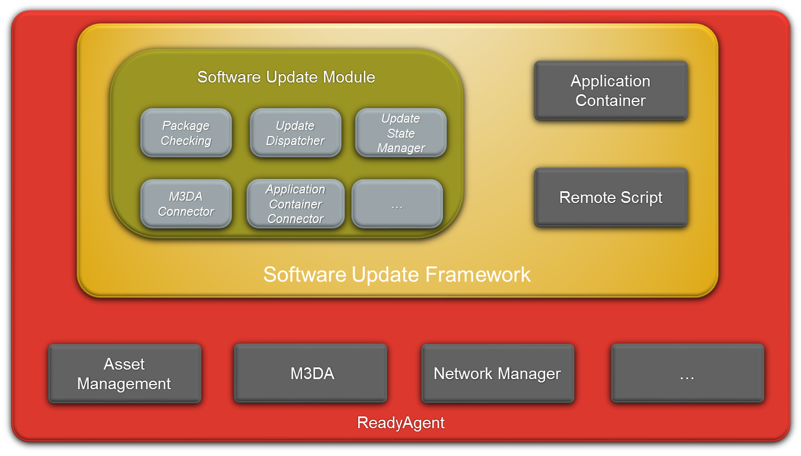

Platform : Software Update Framework
====================================

This page last changed on Feb 04, 2013 by lbarthelemy.

Presentation and source documents
=================================

The easiest way to get introduced to Software Update Framework is to
read
[SoftwareUpdateFramework\_Presentation.ppt](attachments/11108733/18317351.ppt)\
 Then, more technical details can be found in this section and its sub
pages, from Global Description to detailed features description and API.

The schema illustrating Software Update Framework is
[SoftwareUpdateFramework\_Schema.pptx](attachments/11108733/18317352.pptx)

Global Description
==================

Small Description of each element:

-   [Software Update Module](Software%2BUpdate%2BModule.html): manages
    software list (with versions) of components, processes software
    update jobs
    -   [Software Update Package](Software%2BUpdate%2BPackage.html)
        support, with component list management, version checking,
        multiple update in the same package with ordering information,
        ...

-   [Application Container](Application%2BContainer.html): controls
    loading and monitoring of start-up applications
-   [Remote Script](Remote%2BScript.html): enables the execution of Lua
    script on the device, with full access to ReadyAgent features

Attachments:
------------

[SUF.png](attachments/11108733/18317350.png) (image/png) \
 
[SUF.png](attachments/11108733/47874276.png) (image/png) \
 
[SoftwareUpdateFramework\_Presentation.ppt](attachments/11108733/18317382.ppt)
(application/vnd.ms-powerpoint) \
 
[SoftwareUpdateFramework\_Schema.pptx](attachments/11108733/47874275.pptx)
(application/vnd.openxmlformats-officedocument.presentationml.presentation)
\
 
[SoftwareUpdateFramework\_Presentation.ppt](attachments/11108733/47874274.ppt)
(application/vnd.ms-powerpoint) \
 
[SUF.png](attachments/11108733/15499291.png) (image/png) \
 
[SoftwareUpdateFramework\_Presentation.ppt](attachments/11108733/18317351.ppt)
(application/vnd.ms-powerpoint) \
 
[SoftwareUpdateFramework\_Schema.pptx](attachments/11108733/18317352.pptx)
(application/vnd.openxmlformats-officedocument.presentationml.presentation)
\

Document generated by Confluence on Mar 11, 2013 16:16
