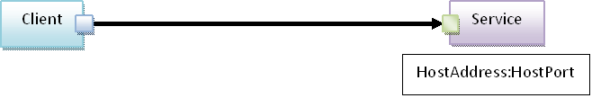
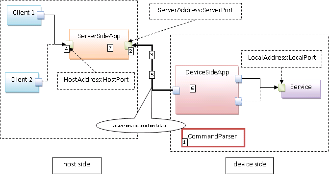
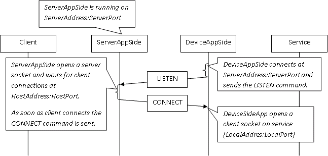
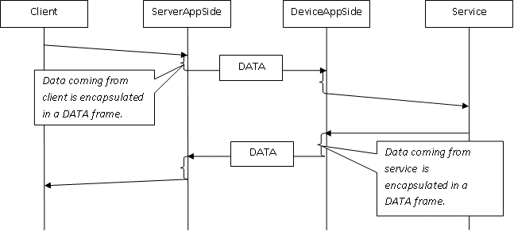
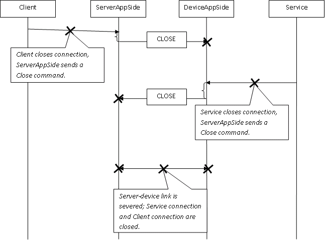

Platform : TCP Remote Connection
================================

This page last changed on Mar 23, 2011 by gilles.

Presentation
============

1.1.Purpose and Principle
-------------------------

This document defines the TCP remote connection feature of the
ReadyAgent. This feature allows a client to connect seamlessly to a
service through a device running ReadyAgent even if the device's IP
address is private.\
 Figure 1 shows the principle scheme of a client (host) accessing a
service.\
 \
 Figure 1: TCP Remote Connection principle

1.2.Implementation
------------------

Figure 2 illustrates the reality the connection of a client to a service
through a device running the ReadyAgent.\
 \
 Figure 2: Remote connection scheme

Here after is described the classical connection use case.\
 **Client** (host side) wants to connect seamlessly on **Service** of
the device (device side).\
 1-CommandParser receives, extracts and executes the TCPRemoteConnect
command with valid parameters **ServerAddress**,
**ServerPort**,**LocalAddress**, **LocalPort**.\
 ServerAddress:ServerPort, is the server socket on the
**ServerSideApp**. LocalAddress:LocalPort is the server socket on the
**Service**.\
 2-**DeviceSideApp** connects at ServerAddress:ServerPort.\
 3-**DeviceSideApp** sends LISTEN command to **ServerSideApp**.\
 4-Upon reception of the LISTEN command, **ServerSideApp** creates
server socket HostAddress:HostPort and wait for client connections.\
 5-As soon as a Client connects, **ServerSideApp** sends a CONNECT
command to make **DeviceSideApp** connect at LocalAddress:LocalPort.\
 6-As soon as socket LocalAddress:LocalPort is closed, **DeviceSideApp**
sends CLOSE command to make **ServerSideApp** close all its client
sockets HostAddress:HostPort.\
 7-Inversely if the client socket HostAddress:HostPort is closed,
**ServerAppSide** sends CLOSE command to make **DeviceSideApp** closes
its client sockets LocalAddress:LocalPort.

If the **ServerAddress:ServerPort** socket is down (whatever the
reason). **ServerAppSide** closes all its **HostAddress:HostPort**
client sockets and **DeviceAppSide** closes all its
**LocalAddress:LocalPort** client sockets\*.\*\
 Obviously we need a specific protocol to channel data and commands
through the **ServerAddress:ServerPort** socket.

1.3.Specific protocol
---------------------

Data and commands are channeled through the server device link using a
big endian binary protocol:

-[Payload size (2b)|CommandId (1b)|ClientId(1b)][Payload (Payload size
b)]\
 CommandId:\
 -CONNECT = 1, connect command sent by ServerAppSide with parameters
local address and local port\
 -CLOSE = 2, close command sent by the DeviceAppSide without parameters\
 -DATA = 3, this command indicates a data exchange\
 -LISTEN = 4, listen command sent by DeviceAppSide without parameters

1.4.Interactions
----------------

Figure 3 describes the server device interactions when the TCP remote
connection is established.\
 \
 Figure 3: TCP remote connection

Figure 4 emphases on the data exchanges.\
 \
 Figure 4: Data exchanges

Figure 5 shows the three closing cases:\
 ·At client request\
 ·At service request\
 ·When the server device link is severed\
 \
 Figure 5: Connection closing

Examples: lua implementation
============================

See [TCPRemoteConnect command definition](Device%2BManagement.html)\
 To start the device side of the TCP remote connection:

~~~~ {.theme: .Confluence; .brush: .java; .gutter: .false
style="font-size:12px;"}
CMD_TCPRemoteConnect = require 'DeviceManagement.TCPRemoteConnect'
local local_address = '10.41.51.152'
local local_port = 23
-- server address and port are stored in the ReadyAgent configuration
_,err = CMD_TCPRemoteConnect(""); p(err)
~~~~

Attachments:
------------

 [Figure
1.PNG](attachments/21038809/21528632.png) (image/png) \
  [Figure
2.PNG](attachments/21038809/21528633.png) (image/png) \
  [Figure
3.PNG](attachments/21038809/23396359.png) (image/png) \
  [Figure
4.PNG](attachments/21038809/21528635.png) (image/png) \
  [Figure
5.PNG](attachments/21038809/21528636.png) (image/png) \
  [Figure
3.PNG](attachments/21038809/21528634.png) (image/png) \
 
[remote\_tcp\_connect\_3.docx](attachments/21038809/23396360.docx)
(application/vnd.openxmlformats-officedocument.wordprocessingml.document)
\

Document generated by Confluence on Mar 11, 2013 16:17
